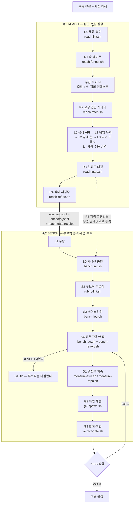

# assay

[](https://github.com/kimsh-1/assay/actions/workflows/ci.yml)
[](LICENSE)

**assay는 웹에서 1차 출처를 뚫어 와 스냅샷에 리터럴로 존재하지 않는 인용을 전부 거부하고, 살아남은 앵커를 채점 기준으로 승격시킨 뒤, 그 기준이 통과시킬 때까지만 대상을 고치는 Claude Code 스킬이다.** 각 단계의 판정은 에이전트의 자기신고가 아니라 exit code가 내린다.

축은 둘이고 둘은 파일 두 장으로만 만난다. **Reach**(접근·수집·적대 재검증)는 `sources.jsonl`과 `anchors.jsonl`을 생산하고, **Bench**(루브릭 승격·개선 루프·판정)는 그 두 파일 밖의 것을 채점 재료로 인정하지 않는다.

The English edition is [README.md](README.md).

<!-- DEMO -->


<sub>40초 쇼케이스 중 10초. 전체 영상은 [`assets/assay-showcase.mp4`](assets/assay-showcase.mp4) — 화면에 나오는 모든 문자열은 이 레포에서 그대로 가져온 것이고 연출한 출력은 없다.</sub>

가장 짧은 시연은 게이트가 작업을 거부하는 장면이다. 아래는 소스 3건짜리 런에서 `skill/scripts/`가 실제로 출력한 내용이다.

```console
$ reach-gate.sh .assay/run1
Reach 게이트 통과: usable=3, primary=2, active-confirmed-anchor=3
→ exit 0 — 사용 가능 소스 3건, 그중 1차 출처 2건, 확정 앵커 3건
→ 앵커 하나의 excerpt를 요약투로 고치고 같은 명령을 다시 실행한다.
  "Write terminal GIFs as code for integration testing and demoing your CLI tools."
  → "Write terminal GIFs as code — for testing and demos."

$ reach-gate.sh .assay/run1
!! Reach 계약 위반: anchors.jsonl:1: excerpt가 스냅샷 원문에 없음
→ exit 2 — 스냅샷에 없는 문자열이다. 요약은 앵커가 아니다.

$ bench-log.sh .assay/run1 R1 A1 4,2,3 "A1만 겨냥"
[R1] min=2 sum=9/12 gate=FAIL verdict=REVERT (하락: A2 — 파레토 위반)
→ exit 1 — 총점은 8에서 9로 올랐으나 A2가 3에서 2로 내려갔다. 파레토 위반이다.

$ bench-log.sh .assay/run1 R2 A2 4,3,3 "다음 라운드"
!! 되돌리지 않은 R1 REVERT 뒤에는 bench-revert.sh를 먼저 실행해야 합니다.
→ exit 2 — R1을 실제로 되돌리지 않았다. 다음 라운드는 기록되지 않는다.
```

exit code는 15개 스크립트 전부 동일하다. `0` 통과, `1` 판정 실패, `2` 계약 위반, `3` 환경 미비, `64` 사용법 오류.

## 빠른 시작

명령 넷, 벽시계로 10초 남짓이며 가입할 서비스는 없다. 아래 선택 도구는 각각 접근 사다리의 한 단을 맡는다. 필수는 아니고, `reach-doctor.sh`가 가용 여부를 보고하며, 없는 단은 다음 단으로 자동 강등된다.

**요구 사항:** bash 3.2 이상, coreutils, python3 3.8 이상(표준 라이브러리만 쓰며 `jq`·`yq`를 요구하지 않는다), git. 선택은 `gh`, `codex` CLI, `insane-search` 스킬이다.

**1. 스킬 설치** (약 5초)

```bash
git clone https://github.com/kimsh-1/assay.git
cp -r assay/skill ~/.claude/skills/assay
```

`~/.claude/skills/assay/`가 생긴다. 구성은 트리거 때마다 상주 로드되는 `SKILL.md` 1본, 온디맨드 문서 `references/` 6본, 집행층 `scripts/` 15본과 `_common.sh`, 계약 데이터 `contracts/` 5본이다.

**2. 깨진 배포본을 설치 전에 거부한다** (1초 미만)

```bash
bash ~/.claude/skills/assay/scripts/install-gate.sh ~/.claude/skills/assay
```

```console
설치 게이트 통과: /home/you/.claude/skills/assay (회귀 8케이스)
```

검사 항목은 macOS 압축 잔재, 스크립트의 실행 권한·shebang 결여, `SKILL.md` frontmatter와 그것이 선언한 파일의 실물 일치, `SKILL.md` 130행 상한, 금지 문자열 잔존, exit code 회귀 픽스처 8케이스다. exit 2가 나면 그 트리는 설치하지 않는다.

**3. 이 환경에서 접근 사다리의 어느 단이 살아 있는지 본다** (약 5초, 읽기 전용 probe)

```bash
bash ~/.claude/skills/assay/scripts/reach-doctor.sh
```

```console
[ok] github: gh-api — probe 성공
  L0 gh-api: ok — probe 성공
  L1 insane-search: missing — insane-search 없음
  L2 webfetch: ok — probe 성공
  L3 jina-reader: ok — 읽기 probe 성공
  L4 manual: warn — 사람 수동 입력 전용
```

`contracts/channels.yml`에 선언된 채널마다 한 블록씩 나온다. `missing`은 실패가 아니라 그 단을 건너뛰고 다음 단을 쓴다는 뜻이다.

**4. 수집을 시작하기 전에 구동 질문을 봉인한다** (즉시)

```bash
cd /개선할/프로젝트/경로
cat > q.md <<'EOF'
질문: 이 레포는 웰메이드 GitHub 레포 루브릭을 통과하는가?
소비처: 공개 발행 여부 결정
EOF
bash ~/.claude/skills/assay/scripts/reach-init.sh .assay/run1 q.md 3 30
```

```console
R0 봉인 완료: .assay/run1
  질문 해시와 수집 하한을 .assay/run1/reach.conf에 기록했다.
다음: reach-fanout.sh .assay/run1 <axes.tsv>
```

런 디렉터리 `.assay/run1/`은 에이전트 작업공간이 아니라 개선 대상 프로젝트 안에 생기며, `question.md`와 봉인물 `reach.conf`(질문 SHA-256·수집 하한·신뢰도 상한), 그 해시를 담은 `reach.conf.seal`을 담는다. 같은 명령을 다시 실행하면 exit 1로 거부된다. 수집이 시작된 뒤 질문을 다시 선언할 수 없게 하는 것이 이 스크립트의 존재 이유다.

이후는 에이전트가 몬다. 질문을 하위 질문 3~7개로 팬아웃하고 축마다 수집 워커를 하나씩 두며, URL마다 고정된 사다리를 타고, `reach-gate.sh`를 통과시키고, 다른 맥락에서 앵커를 재검증하고, 합격선을 봉인하고, 루브릭을 lint하고, 베이스라인을 잰 뒤 한 번에 한 축씩 고친다. 각 단계는 스크립트 하나이며 전부 거부할 수 있다. 행위 주체와 전체 트레이스는 [docs/how-it-works.md](docs/how-it-works.md)에 있다.

## 왜 이렇게 만들었는가

**레퍼런스를 감상하지 말고 채점 기준으로 승격시켜라. 그리고 그 기준이 통과시킬 때까지만 고쳐라.**

이 한 문장에서 규칙 셋이 나오고, 셋은 전부 관례가 아니라 스크립트다.

**앵커는 요약이 아니라 리터럴 부분문자열이다.** `reach-gate.sh`는 저장된 스냅샷을 다시 읽어 excerpt가 그 안에 있는지 대조한다. `grep -F`와 동등한 비교이며 말줄임·정규화·번역을 허용하지 않는다. 바꿔 쓴 인용은 exit 2를 받고 런은 진행되지 않는다. "요약은 채점에 쓸 수 없다"를 기계로 집행하는 유일한 수단이 이것이고, 모든 소스가 SHA-256과 함께 스냅샷으로 남아야 소스로 인정되는 이유도 같다.

**사후 조정 가능한 합격선은 게이트가 아니라 장식이다.** `bench-init.sh`는 축·`min`·`sum`과 수집 데이터에서 승격된 계측 임계값을 `gate.conf`에 봉인하고, 이미 존재하는 봉인의 재선언을 exit 1로 거부한다. `.seal` 사이드카가 그 파일의 해시를 들고 있어 루프 도중의 수정은 소비자 전원에게 탐지된다.

**판정 실패는 권고가 아니다.** `bench-log.sh`는 `min`·`sum`·게이트 결과·파레토 비교를 스스로 계산한다. 사람이 넣는 것은 축별 점수뿐이다. 한 축이라도 내려가면 그 라운드는 REVERT이고 exit 1이며, `bench-revert.sh`가 파일을 실제로 복원하고 복원된 트리의 해시를 남기기 전까지 **다음** 라운드는 exit 2로 거부된다. "다음 라운드에서 고려하겠다"는 되돌림이 아니다.

### 계보 요약

루프 규율은 [karpathy/autoresearch](https://github.com/karpathy/autoresearch)에서 상속했다. 측정하고, 나빠지면 되돌리고, 전량 로깅하고, 동점이면 단순한 쪽을 승리로 친다. 네 조항 모두 `program.md` 원문 인용이며 재검증을 거쳤다.

뒤집은 지점은 둘이고 둘 다 의도적이다. 첫째, 원전은 "The loop runs until the human interrupts you, period"이지만 assay는 봉인된 합격선에 도달하거나 REVERT가 3연속이면 반드시 멈춘다. 무한히 도는 것은 성실함이 아니라 진단 실패다. 둘째, 원전의 단일 스칼라 `val_bpb`를 `PASS ⟺ min(축) ≥ M AND sum(축) ≥ S` 판정식을 갖는 다축 앵커 루브릭으로 교체했다.

두 번째 부모로 지목되던 것은 검증을 통과하지 못했다. 전신 스킬은 `reference-research`라는 스킬을 절 번호까지 달아 8곳에서 인용했으나, 그 문서는 이 머신에도 없고 인용문과 일치하는 공개 출처도 없다. 인용을 전부 삭제했고, `install-gate.sh`가 그 문자열의 재유입을 exit 2로 막는다. 각 주장의 CONFIRMED·UNVERIFIED·REFUTED 판정은 [docs/genealogy.md](docs/genealogy.md)에 전량 남겼다.

## 아키텍처



접합부는 악수가 아니라 영수증이다. `reach-gate.sh`는 통과 시 `reach-gate.receipt`를 쓰고 그 시점의 `reach.conf`·`sources.jsonl`·`anchors.jsonl` SHA-256을 기록한다. `bench-init.sh`·`rubric-lint.sh`·`verdict-gate.sh`는 영수증이 없거나 해시가 달라지면 시작 자체를 exit 2로 거부한다. 게이트를 통과한 뒤 앵커를 고칠 수 없고, Reach를 거치지 않고 손으로 만든 파일 위에서 Bench를 돌릴 수도 없다.

### 레포 구조

```
assay/
├── skill/                  설치되는 스킬 본체
│   ├── SKILL.md            선언층. 트리거 때마다 상주 로드(130행 상한)
│   ├── references/         온디맨드 문서 6본(한국어 운용 매뉴얼)
│   ├── scripts/            집행층 15본 + _common.sh
│   └── contracts/          channels.yml, JSON 스키마 2본, 형판 2본
├── docs/                   이 레포 자체의 문서(영문)
├── CONTRIBUTING.md  SECURITY.md  CHANGELOG.md  LICENSE
└── README.md  README.ko.md
```

런은 스킬 디렉터리에도 에이전트 작업공간에도 쓰지 않는다. 개선 대상 프로젝트 안의 `.assay/<run>/`에 봉인 파일, `sources/` 스냅샷, 계약 JSONL 2종, `fetch-log.jsonl`, `rubric.md`, `scores.tsv`, 해시 체인이 걸린 `rounds.jsonl`, `metrics/`, `g2/`, `counterexample.md`를 남긴다.

## 문서

설명보다 런을 먼저 본다. [`examples/`](examples/)에 실제 런 하나가 손대지 않은 채로 들어 있다 —
실제 소스 수집, 실제 독립 채점자, 그리고 둘을 묶는 영수증. 그 런에서 자기채점 `4,1,1`이 독립 채점
`3,0,0`을 만났고 낮은 쪽이 이의 없이 채택됐다. 이 레포가 무엇을 하는 물건인지에 대한 가장 짧은 답이다.

아래 문서 계층은 독자가 서로 다르다.

| 문서 | 용도 |
|---|---|
| [examples/README.md](examples/README.md) | 기록된 런의 단계별 해설. 어느 스크립트가 어떤 산출물을 냈고 영수증이 무엇을 증명하는지. 읽기보다 돌아가는 것을 보고 싶으면 여기부터. |
| [docs/how-it-works.md](docs/how-it-works.md) | 1런 전체 트레이스. 행위 주체(사용자·메인 에이전트·워커·스크립트) 구분, R0~G3 시퀀스 다이어그램, 규모 분기 3경로의 차이. 중요한 대상에 이 스킬을 걸기 전에 읽는다. |
| [docs/gates.md](docs/gates.md) | 스크립트 15본 레퍼런스. 각 스크립트가 물리적으로 무엇을 거부하며 어떤 exit code로 거부하는지의 표. 거부당했을 때 입력을 고칠지 결과물을 고칠지 판단하려면 여기를 본다. |
| [docs/design-decisions.md](docs/design-decisions.md) | 봉인·영수증·해시 체인·출처 증명이 왜 필요했는지를 그것을 강제한 적대감사 결함과 함께 기록했다. 집행 기전을 손대기 전에 읽는다. |
| [docs/genealogy.md](docs/genealogy.md) | 규율의 출처. 실패한 주장까지 포함해 CONFIRMED·UNVERIFIED·REFUTED 판정을 그대로 남겼다. 우리가 어떤 주장을 스스로 근거로 쓰지 않는지 확인하려면 여기를 본다. |

스킬 안에서 상주 로드되는 것은 [`skill/SKILL.md`](skill/SKILL.md) 하나뿐이고 무거운 서술은 전부 온디맨드다.

| 파일 | 여는 시점 |
|---|---|
| [`skill/references/reach-protocol.md`](skill/references/reach-protocol.md) | 질문 고정·축 분할·수집·재검증 |
| [`skill/references/access-ladder.md`](skill/references/access-ladder.md) | 접근이 막혔거나 인증이 요구되거나 환경을 진단할 때 |
| [`skill/references/rubric-design.md`](skill/references/rubric-design.md) | 축 유도·0~4 앵커 작성·판정식 결정 |
| [`skill/references/loop-protocol.md`](skill/references/loop-protocol.md) | 라운드 운영·파레토 비교·되돌림·정체 진단 |
| [`skill/references/contracts.md`](skill/references/contracts.md) | JSONL·TSV 작성과 검토, exit code 계약 확인 |
| [`skill/references/instruments.md`](skill/references/instruments.md) | 새 대상 유형의 계측기를 새로 쓸 때 |

계약 데이터 5종 중 둘은 파싱 대상일 뿐 아니라 사람이 직접 읽는 문서다. [`skill/contracts/rubric.template.md`](skill/contracts/rubric.template.md)는 `rubric-lint.sh`가 대조하는 루브릭 형판이고, [`skill/contracts/g2-prompt.md`](skill/contracts/g2-prompt.md)는 독립 채점자가 받는 프롬프트 정본이다.

`skill/` 아래는 전부 한국어다. 스킬이 한국어로 운용되고 그것이 다루는 excerpt는 번역되어서는 안 되므로, 이중언어 유지비는 이 레포의 공개 문서 한 계층에서만 지불한다. [비목표](#한계-비목표-범위)를 함께 본다.

## 한계, 비목표, 범위

**하지 않는 것**

- **CLI 애플리케이션이 아니다.** 에이전트가 모는 Claude Code 스킬이며 구성은 bash 스크립트·문서·계약 데이터다. 데몬도 바이너리도 패키지 배포도 없다.
- **채널별 스크레이퍼를 동봉하지 않는다.** 플랫폼별 파서, 로그인 흐름, 쿠키 관리가 없다. `channels.yml`은 라우팅 선언 데이터일 뿐 실행 코드가 아니며, 사이트 상수가 `scripts/`로 새면 `install-gate.sh`가 트리를 거부한다. 실제로 뚫는 일은 위임한다.
- **자격증명을 취득하거나 저장하지 않는다.** 로그인 대행, 브라우저 쿠키 자동 열람, API 키 발급을 하지 않는다. `auth_required`와 `not_found`는 재시도 대상이 아니라 terminal 상태이며 L4로 내려가 사람이 원문을 붙여넣고 출처를 명기한다.
- **보고서를 대신 쓰지 않는다.** 산출물은 판정과 재현 가능한 계약 파일이다. 산문 합성·번역·요약은 이 스킬의 일이 아니며, 애초에 요약은 이 스킬이 근거로 인정하지 않는 형식이다.
- **일반 웹 검색의 대체재가 아니다.** `WebSearch` 한 번으로 끝나는 질의에는 켜지 않는다.
- **스킬 문서의 이중언어화는 명시적 비목표다.**

**집행이 닿지 않는 곳**

- **`.seal`은 변조 방지가 아니라 변조 탐지다.** seal은 해당 파일의 해시를 담은 평범한 사이드카다. 루프 도중의 무심한 한 줄 `sed`와 실패 후 합격선을 슬쩍 낮추는 일은 막지만, `gate.conf`와 `gate.conf.seal`을 **함께** 고치는 상대는 막지 못한다. seal이 자기 자신을 봉인하면 무한 재귀가 되기 때문이다. `rounds.jsonl` 해시 체인과 G2 영수증도 같다. 조작을 불가능하게 만드는 것이 아니라 드러나게 만든다. PASS를 위조하려는 사람은 여전히 위조할 수 있고, 다만 실수로는 못 한다.
- **G2 독립성은 편향 축소이지 완전 독립이 아니다.** 채점자는 개선 이력이 제외된 프롬프트를 받아 모델이 핀 고정된 별도 `codex` 프로세스로 돌지만, 오케스트레이터는 같다. `g2-spawn.sh`는 이 한계를 자기 산출물 옆에 기록한다.
- **루브릭은 산출물을 재지 착상을 재지 않는다.** 전 축 4점을 받고도 쓸모없는 소프트웨어일 수 있다. 유용성은 루프가 아니라 루프 이전에 결정된다.

**그 수요를 받는 곳**

| 필요한 것 | 갈 곳 |
|---|---|
| 트위터·레딧·유튜브·빌리빌리·샤오홍슈 등 차단된 플랫폼에서 실제로 본문을 가져오기 | [Panniantong/Agent-Reach](https://github.com/Panniantong/Agent-Reach) — API 비용 없이 채널 접근을 담당하는 CLI |
| 완강한 URL 한 건에 대한 WAF 우회·TLS 임퍼소네이션·실제 크롬 폴백 | [fivetaku/gptaku_plugins](https://github.com/fivetaku/gptaku_plugins)의 `insane-search` 스킬 — assay가 L1 단에서 위임하는 대상 |
| 단일 메트릭 자율 개선 루프의 원전 | [karpathy/autoresearch](https://github.com/karpathy/autoresearch) |

## 기여

버그 보고와 재현 절차는 환영한다. 기능 추가는 좁게 받는다. 이 레포의 상품은 게이트이므로 우회 플래그·환경변수 뒷문·검증 생략 모드를 추가하는 PR은 그것이 아무리 편리해도 닫는다. 집행을 바꾸는 변경에는 변경 전에 실패하고 변경 후에 통과하는 회귀 픽스처가 함께 와야 한다. 전문은 [CONTRIBUTING.md](CONTRIBUTING.md)에, 우회 경로를 발견했을 때 이슈 대신 취할 절차는 [SECURITY.md](SECURITY.md)에 있다.

릴리스 이력은 [CHANGELOG.md](CHANGELOG.md)에 있다.

## 라이선스

MIT — [LICENSE](LICENSE).
