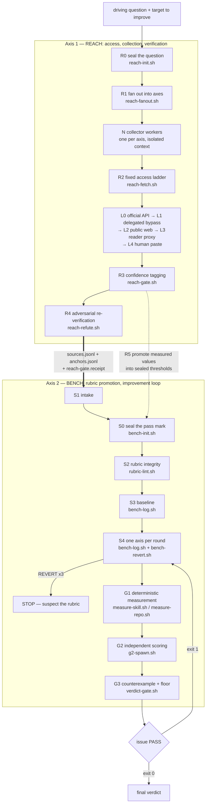

# assay

[](https://github.com/kimsh-1/assay/actions/workflows/ci.yml)
[](LICENSE)

**assay is a Claude Code skill that pulls primary-source evidence off the web, refuses any quotation that is not a literal substring of a stored snapshot, promotes the surviving anchors into a sealed rubric, and then improves the target only until that rubric passes.** Every step is enforced by an exit code, not by an agent's self-report.

Two axes, joined by exactly two files: **Reach** (access, collection, adversarial re-verification) produces `sources.jsonl` and `anchors.jsonl`; **Bench** (rubric promotion, improvement loop, verdict) refuses to score anything outside those two files.

한국어 문서는 [README.ko.md](README.ko.md).

<!-- DEMO -->


<sub>Ten seconds of the 40-second showcase. Full video: [`assets/assay-showcase.mp4`](assets/assay-showcase.mp4) — every string in it is copied verbatim from this repository, nothing staged.</sub>

The shortest demonstration is the gate refusing work. Every line below is real output from `skill/scripts/`, captured on a three-source run:

```console
$ reach-gate.sh .assay/run1
Reach 게이트 통과: usable=3, primary=2, active-confirmed-anchor=3
→ exit 0 — 3 usable sources, 2 of them primary, 3 confirmed anchors
→ now edit one anchor's excerpt into a paraphrase and run the same command again:
  "Write terminal GIFs as code for integration testing and demoing your CLI tools."
  becomes "Write terminal GIFs as code — for testing and demos."

$ reach-gate.sh .assay/run1
!! Reach 계약 위반: anchors.jsonl:1: excerpt가 스냅샷 원문에 없음
→ exit 2 — that string is not in the snapshot. A summary is not an anchor.

$ bench-log.sh .assay/run1 R1 A1 4,2,3 "targeted A1"
[R1] min=2 sum=9/12 gate=FAIL verdict=REVERT (하락: A2 — 파레토 위반)
→ exit 1 — the total rose 8 to 9, but A2 fell 3 to 2. Pareto violation.

$ bench-log.sh .assay/run1 R2 A2 4,3,3 "next round"
!! 되돌리지 않은 R1 REVERT 뒤에는 bench-revert.sh를 먼저 실행해야 합니다.
→ exit 2 — R1 was never actually reverted. The next round is not recorded.
```

The scripts speak Korean; the exit codes are the contract. `0` pass, `1` verdict failure, `2` contract violation, `3` missing environment, `64` usage error — identical across all 15 entry points.

## Quick start

Four commands, about ten seconds of wall clock, no service to sign up for. The optional tools below each back one rung of the access ladder; none is mandatory, `reach-doctor.sh` reports which ones exist, and a missing rung degrades to the next one.

**Requirements:** bash 3.2+, coreutils, python3 3.8+ (standard library only, no `jq`/`yq`), git. Optional: `gh`, `codex` CLI, the `insane-search` skill.

**1. Install the skill** (~5 s)

```bash
git clone https://github.com/kimsh-1/assay.git
cp -r assay/skill ~/.claude/skills/assay
```

Creates `~/.claude/skills/assay/`: `SKILL.md` (the only file loaded on every trigger), `references/` (6 on-demand documents), `scripts/` (15 entry points + `_common.sh`), `contracts/` (5 data contracts).

**2. Refuse a broken install before it ships** (<1 s)

```bash
bash ~/.claude/skills/assay/scripts/install-gate.sh ~/.claude/skills/assay
```

```console
설치 게이트 통과: /home/you/.claude/skills/assay (회귀 8케이스)
```

Checks macOS archive residue, missing shebangs and exec bits, `SKILL.md` front matter against the files it declares, the 130-line ceiling on `SKILL.md`, banned strings, and 8 exit-code regression fixtures. Exit 2 means do not install this tree.

**3. See which rungs of the access ladder work here** (~5 s, read-only network probes)

```bash
bash ~/.claude/skills/assay/scripts/reach-doctor.sh
```

```console
[ok] github: gh-api — probe 성공
  L0 gh-api: ok — probe 성공
  L1 insane-search: missing — insane-search 없음
  L2 webfetch: ok — probe 성공
  L3 jina-reader: ok — 읽기 probe 성공
  L4 manual: warn — 사람 수동 입력 전용
```

One block per channel declared in `contracts/channels.yml`. `missing` is not a failure — it means that rung is skipped and the next one is used.

**4. Seal the driving question before collecting anything** (instant)

```bash
cd /path/to/the/project/you/are/improving
cat > q.md <<'EOF'
질문: 이 레포는 웰메이드 GitHub 레포 루브릭을 통과하는가?
소비처: 공개 발행 여부 결정
EOF
bash ~/.claude/skills/assay/scripts/reach-init.sh .assay/run1 q.md 3 30
```

```console
R0 봉인 완료: .assay/run1
  질문 해시와 수집 하한을 .assay/run1/reach.conf에 기록했다.
다음: reach-fanout.sh .assay/run1 <axes.tsv>
```

Creates `.assay/run1/` inside the target project — never in the agent's workspace — holding `question.md`, `reach.conf` (question SHA-256, minimum sources, confidence ceilings) and `reach.conf.seal`. Run it a second time and it exits 1: the question cannot be redeclared once collection has started.

From here the agent drives: fan out the question into 3–7 sub-questions, one collector worker each; climb the fixed access ladder per URL; pass `reach-gate.sh`; re-verify the anchors from a different context; seal the pass mark; lint the rubric; baseline; loop one axis at a time. Each of those is a single script and each of them can refuse. The full trace, including who does what, is in [docs/how-it-works.md](docs/how-it-works.md).

## Why this is built the way it is

**Do not admire a reference. Promote it into a scoring criterion, and then fix the work only until that criterion passes.**

That single sentence produces three rules, and each rule is a script rather than a convention.

**An anchor is a literal substring, not a summary.** `reach-gate.sh` re-reads the stored snapshot and looks for the excerpt inside it — the `grep -F` equivalent, no ellipsis, no normalization, no translation. A paraphrase raises exit 2 and the run cannot proceed. This is the only mechanical way to enforce "a summary cannot be used for scoring", and it is why every source must be snapshotted with its SHA-256 before it counts as a source at all.

**A pass mark that can be adjusted afterwards is decoration, not a gate.** `bench-init.sh` seals the axes, `min`, `sum` and any measurement thresholds promoted from the collected data into `gate.conf`, and refuses to redeclare an existing one (exit 1). A `.seal` sidecar holds the file's hash so that a mid-loop edit is detected by every consumer.

**A verdict failure is not a suggestion.** `bench-log.sh` computes `min`, `sum`, the gate result and the Pareto comparison itself; the human supplies only per-axis scores. If any axis dropped, the round is REVERT and exit 1 — and the *next* round is refused with exit 2 until `bench-revert.sh` has actually restored the files and left a hash of the restored tree. "I will consider it next round" is not a revert.

### Genealogy, short version

The loop discipline is inherited from [karpathy/autoresearch](https://github.com/karpathy/autoresearch): measure, revert when anything regresses, log every round, and treat a simplification at equal score as a win. Those four are quoted from `program.md` and were re-verified against the original.

Two inversions are deliberate. autoresearch says *"The loop runs until the human interrupts you, period."* — assay always stops, either at the sealed pass mark or after three consecutive REVERTs, because an endless loop is a diagnostic failure, not diligence. And autoresearch's single scalar `val_bpb` is replaced by a multi-axis anchored rubric with `PASS ⟺ min(axis) ≥ M AND sum(axis) ≥ S`.

The second claimed parent did not survive verification. A skill called `reference-research` was cited in eight places of the predecessor, complete with section numbers — it exists neither on this machine nor in any public source that matches those quotations. All citations were removed, and `install-gate.sh` now fails the tree if the string comes back. Every claim, with its CONFIRMED / UNVERIFIED / REFUTED verdict, is in [docs/genealogy.md](docs/genealogy.md).

## Architecture



The junction is a receipt, not a handshake. When `reach-gate.sh` passes it writes `reach-gate.receipt` recording the SHA-256 of `reach.conf`, `sources.jsonl` and `anchors.jsonl` at that moment. `bench-init.sh`, `rubric-lint.sh` and `verdict-gate.sh` all refuse to start (exit 2) if the receipt is missing or if those hashes no longer match — so anchors cannot be edited after passing the gate, and Bench cannot be run on hand-written files that never went through Reach.

### Repository layout

```
assay/
├── skill/                  the installable skill
│   ├── SKILL.md            declaration layer, loaded on every trigger (<= 130 lines)
│   ├── references/         6 on-demand documents (Korean, the operating manual)
│   ├── scripts/            15 entry points + _common.sh, the enforcement layer
│   └── contracts/          channels.yml, 2 JSON schemas, 2 templates
├── docs/                   this repository's own documentation (English)
├── CONTRIBUTING.md  SECURITY.md  CHANGELOG.md  LICENSE
└── README.md  README.ko.md
```

A run never writes into the skill or the agent workspace. It writes `.assay/<run>/` inside the project being improved: sealed configs, `sources/` snapshots, both JSONL contracts, `fetch-log.jsonl`, `rubric.md`, `scores.tsv`, `rounds.jsonl` (hash-chained), `metrics/`, `g2/`, `counterexample.md`.

## Documentation

Start with the run, not the prose: [`examples/`](examples/) holds one complete run captured verbatim
— live sources, a live independent scorer, and the receipts that bind them. In it the self-score of
`4,1,1` met an independent `3,0,0` and the lower number was adopted without argument. That row is the
shortest available answer to what this repository is for.

The written layers below are for different readers.

| Document | What it is for |
|---|---|
| [examples/README.md](examples/README.md) | The recorded run, step by step: which script produced which artifact, and what the receipts prove. Read this first if you would rather see the thing work than read about it. |
| [docs/how-it-works.md](docs/how-it-works.md) | One complete run, traced. Who acts (user / main agent / worker / script), a sequence diagram of R0→G3, and how the three scale branches differ. Read this before running the skill on something that matters. |
| [docs/gates.md](docs/gates.md) | Reference for all 15 scripts: what each one physically refuses, and the exit code it uses to do so. Read this when a script rejected you and you want to know whether to fix the input or fix the work. |
| [docs/design-decisions.md](docs/design-decisions.md) | Why the seal, the receipt, the hash chain and the provenance sidecars exist — each traced to the adversarial audit finding that forced it — plus the specification revisions those findings caused. Read this before changing an enforcement mechanism. |
| [docs/genealogy.md](docs/genealogy.md) | Where the rules came from, with every claim marked CONFIRMED, UNVERIFIED or REFUTED, including the ones that failed. Read this if you want to know which of our own claims we do not stand behind. |

Inside the skill, [`skill/SKILL.md`](skill/SKILL.md) is the only file loaded on every trigger; everything heavy is on demand:

| File | Opened when |
|---|---|
| [`skill/references/reach-protocol.md`](skill/references/reach-protocol.md) | Fixing the question, splitting axes, collecting, re-verifying |
| [`skill/references/access-ladder.md`](skill/references/access-ladder.md) | A fetch was blocked, needs auth, or the environment is being diagnosed |
| [`skill/references/rubric-design.md`](skill/references/rubric-design.md) | Deriving axes, writing 0–4 anchors, choosing the verdict formula |
| [`skill/references/loop-protocol.md`](skill/references/loop-protocol.md) | Running rounds, Pareto comparison, reverting, diagnosing a stall |
| [`skill/references/contracts.md`](skill/references/contracts.md) | Writing or reviewing the JSONL / TSV files and the exit-code contract |
| [`skill/references/instruments.md`](skill/references/instruments.md) | Writing a new measurement instrument for a new target type |

Two of the five data contracts are meant to be read rather than only parsed: [`skill/contracts/rubric.template.md`](skill/contracts/rubric.template.md) is the shape `rubric-lint.sh` checks a rubric against, and [`skill/contracts/g2-prompt.md`](skill/contracts/g2-prompt.md) is the exact prompt the independent scorers receive.

Everything under `skill/` is Korean. That is deliberate: the skill is operated in Korean and the excerpts it handles must never be translated, so bilingual maintenance is paid at exactly one layer — this repository's public documentation. See [Non-goals](#limitations-non-goals-and-scope).

## Limitations, non-goals and scope

**What assay does not do**

- **It is not a CLI application.** It is a Claude Code skill: bash scripts, documents and data contracts driven by an agent. There is no daemon, no binary, no package on any registry.
- **It ships no channel scrapers.** No per-platform parser, no login flow, no cookie handling. `channels.yml` is routing *declaration*, not executable site logic, and `install-gate.sh` fails the tree if brand-specific strings leak into `scripts/`. The actual breaking-through is delegated.
- **It never acquires or stores credentials.** No login on your behalf, no reading of browser cookies, no API-key provisioning. `auth_required` and `not_found` are terminal verdicts that drop to L4, where a human pastes the text and names the source.
- **It does not write your report.** The output is a verdict plus reproducible contract files. Prose synthesis, translation and summarization are somebody else's job — and a summary is exactly what this skill refuses to accept as evidence.
- **It is not a replacement for web search.** If one `WebSearch` call answers the question, do not turn this on.
- **The skill's own documentation stays Korean.** Bilingual `references/` is an explicit non-goal.

**What the enforcement does not reach**

- **`.seal` is tamper-evidence, not tamper-proofing.** The seal is a plain sidecar holding the file's hash. It stops a careless one-line `sed` on `gate.conf` in the middle of a loop, and it stops the pass mark being quietly lowered after a failure. It does **not** stop someone who edits `gate.conf` and `gate.conf.seal` together — the seal cannot seal itself without infinite recursion. The same holds for the `rounds.jsonl` hash chain and the G2 receipt: they make manipulation detectable, not impossible. Anyone who wants to fake a PASS can still do so; they simply cannot do it by accident.
- **G2 independence is reduced bias, not true independence.** The scorers run as separate `codex` processes with a pinned model and a prompt assembled without the improvement history, but they run under the same orchestrator. `g2-spawn.sh` records that limitation next to its own output rather than claiming otherwise.
- **The rubric measures the artifact, not the idea.** A repository can score 4 on every axis and still be useless software. Usefulness is decided before the loop starts, not by it.

**Where to take the rest**

| If you need | Go to |
|---|---|
| Actually retrieving content from Twitter / Reddit / YouTube / Bilibili / XiaoHongShu and other blocked platforms | [Panniantong/Agent-Reach](https://github.com/Panniantong/Agent-Reach) — a CLI covering channel access with no API fees |
| WAF bypass, TLS impersonation, real-Chrome fallback for a single stubborn URL | the `insane-search` skill in [fivetaku/gptaku_plugins](https://github.com/fivetaku/gptaku_plugins) — this is the L1 rung assay delegates to |
| The original single-metric autonomous improvement loop | [karpathy/autoresearch](https://github.com/karpathy/autoresearch) |

## Contributing

Bug reports and reproductions are welcome; new features are accepted narrowly. The gates are the product, so a pull request that adds a bypass flag, an environment-variable escape hatch, or a "skip verification" mode will be closed regardless of how convenient it is. Changes to enforcement must come with a regression fixture that fails before the change and passes after it. See [CONTRIBUTING.md](CONTRIBUTING.md) for the full policy, and [SECURITY.md](SECURITY.md) for what to do with a bypass you found instead of an issue.

Release history is in [CHANGELOG.md](CHANGELOG.md).

## License

MIT — see [LICENSE](LICENSE).
