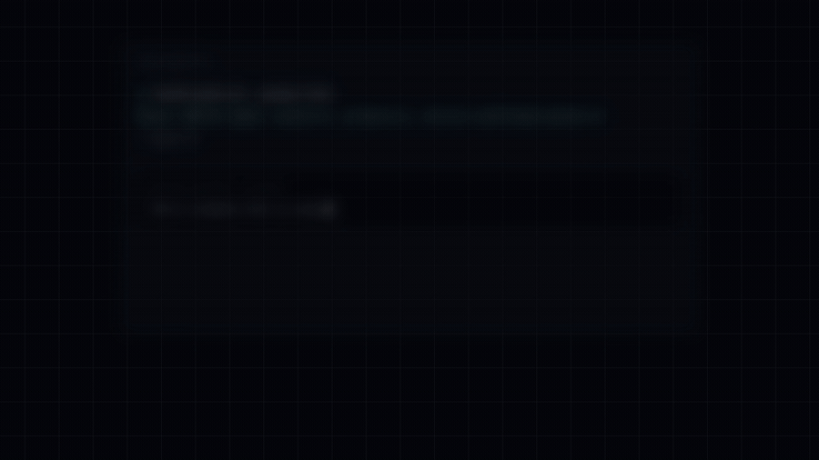

# assay

[](https://github.com/gongnyang/assay/actions/workflows/ci.yml)
[](LICENSE)
[한국어 문서 — README.ko.md](README.ko.md)

**If the grader and the graded are the same, it isn't a score.**

assay is a Claude Code skill built around that one problem. It pulls source material off the web and stores it, promotes into scoring criteria only the quotations that survive character-for-character inside what was stored, and improves the work until those criteria pass — and no further. A pass is declared by a script. Never by the agent.

Three words do most of the work in this document. **Reach** is the axis that goes out to the web and keeps what it finds as a snapshot. **Bench** is the axis that builds a pass mark out of those quotations and scores against it. An **anchor** is one quotation that is still in the snapshot, character for character.

## The gate refusing work

<!-- DEMO -->


<sub>Ten seconds out of a 40-second showcase. Full video: [`assets/assay-showcase.mp4`](assets/assay-showcase.mp4) — every string on screen came out of this repository, and none of the output is staged.</sub>

Watching it refuse work is quicker than reading about it. The four blocks below are what `skill/scripts/` actually printed on a run with three sources. The scripts speak Korean; the exit code is the contract.

```console
$ reach-gate.sh .assay/run1
Reach 게이트 통과: usable=3, primary=2, active-confirmed-anchor=3
→ exit 0 — 사용 가능 소스 3건, 그중 1차 출처 2건, 확정 앵커 3건
→ 앵커 하나의 excerpt를 요약투로 고치고 같은 명령을 다시 실행한다.
  "Write terminal GIFs as code for integration testing and demoing your CLI tools."
  → "Write terminal GIFs as code — for testing and demos."

$ reach-gate.sh .assay/run1
!! Reach 계약 위반: anchors.jsonl:1: excerpt가 스냅샷 원문에 없음
→ exit 2 — 스냅샷에 없는 문자열이다. 요약은 앵커가 아니다.

$ bench-log.sh .assay/run1 R1 A1 4,2,3 "A1만 겨냥"
[R1] min=2 sum=9/12 gate=FAIL verdict=REVERT (하락: A2 — 파레토 위반)
→ exit 1 — 총점은 9로 유지됐으나(A1 3→4, A3 불변) A2가 3에서 2로 내려갔다. 파레토 위반이다.

$ bench-log.sh .assay/run1 R2 A2 4,3,3 "다음 라운드"
!! 되돌리지 않은 R1 REVERT 뒤에는 bench-revert.sh를 먼저 실행해야 합니다.
→ exit 2 — R1을 실제로 되돌리지 않았다. 다음 라운드는 기록되지 않는다.
```

Between the first block and the second, the only thing that changed was one quotation, tidied into a summary. The gate stopped recognizing it as an anchor. The third block is a round whose total held while one axis fell, and the fourth is an attempt to record the next round without doing the revert that failure demanded. Nobody judged any of the four. A script refused with an exit code, and there is no flag and no environment variable anywhere in this tree that turns those refusals into a pass.

## When to use it, when not to

**Don't admire a reference. Promote it into a scoring criterion, and then fix the work only until that criterion passes.**

Turn it on when you have to gather several web sources and you will want to reopen the originals later. When the work has to improve against a reference somebody else can check, rather than against your own account of it. When you need a pass mark and you don't entirely trust yourself not to lower it once you fail it. Triggers look like "score this against references", "collect the evidence into a rubric", "benchmark it and improve it until it passes", "quality gate".

Leave it off in these cases.

- A question that ends with one fact. If a single `WebSearch` answers it, use that instead.
- Writing a report, a translation or a summary from material you already have. A summary is not a form this skill accepts as evidence.
- Anything that involves publishing, logging in, cookies or API keys. It does none of those.
- A skill for that specific platform is already installed. Use that one first.

## Quick start

Four commands, about ten seconds of wall clock, nothing to sign up for.

**Requirements:** bash 3.2 or newer, coreutils, python3 3.8 or newer (standard library only, no `jq` or `yq`), git. Optional: `gh`, the `codex` CLI, the `insane-search` skill.

```bash
git clone https://github.com/gongnyang/assay.git
cp -r assay/skill ~/.claude/skills/assay
bash ~/.claude/skills/assay/scripts/install-gate.sh ~/.claude/skills/assay
```

```console
설치 게이트 통과: /home/you/.claude/skills/assay (회귀 18케이스)
```

The third command is the shipping hygiene gate. It looks for macOS archive residue, missing exec bits and shebangs, files that `SKILL.md` declares but that are not actually there, the 130-line ceiling being blown, and it runs 18 regression cases that pin the exit codes and this README's structure together. A tree that exits 2 does not get installed.

```bash
bash ~/.claude/skills/assay/scripts/reach-doctor.sh
```

```console
[ok] github: gh-api — probe 성공
  L0 gh-api: ok — probe 성공
  L1 insane-search: missing — insane-search 없음
  L2 webfetch: ok — probe 성공
  L3 jina-reader: ok — 읽기 probe 성공
  L4 manual: warn — 사람 수동 입력 전용
```

One block per channel declared in `contracts/channels.yml`. The probes are read-only, and the diagnostic path writes nothing at all. `missing` is not a failure — it means that rung is skipped and the next one is used.

```bash
cd /개선할/프로젝트/경로
cat > q.md <<'EOF'
질문: 이 레포는 웰메이드 GitHub 레포 루브릭을 통과하는가?
소비처: 공개 발행 여부 결정
EOF
bash ~/.claude/skills/assay/scripts/reach-init.sh .assay/run1 q.md 3 30
```

```console
R0 봉인 완료: .assay/run1
  질문 해시와 수집 하한을 .assay/run1/reach.conf에 기록했다.
다음: reach-fanout.sh .assay/run1 <axes.tsv>
```

The run directory is created inside the project being improved, not in the agent's workspace. Run the same command again and it refuses with exit 1. Making the question unwritable once collection has begun is the only reason this script exists.

The agent drives from here. Who acts at each step, and the trace of a whole run, is in [docs/how-it-works.md](docs/how-it-works.md).

## What a run leaves behind

[`examples/`](examples/) holds one real run, untouched. 2026-07-29, live network, live Codex workers.

| Stage | Script | What it leaves in `.assay/run1/` |
|---|---|---|
| R0 | `reach-init.sh` | `reach.conf` + `reach.conf.seal` — the sealed collection floor |
| R1 | `reach-fanout.sh` | `axes.tsv`, `briefs/AX-{1,2,3}.md` — one collection brief per axis |
| R2 | `reach-fetch.sh` ×3 | `sources/R-{A,B,C}.md` snapshots, `sources.jsonl`, `fetch-log.jsonl` |
| R3 | `reach-gate.sh` | `anchors.jsonl`, **`reach-gate.receipt`** — the only door into Bench |
| S0 | `bench-init.sh` | `gate.conf` + `gate.conf.seal` — the pass mark, sealed before any scoring happens |
| S2 | `rubric-lint.sh` | a `rubric.md` that passed validation |
| G2 | `g2-spawn.sh` | `g2/worker-1.csv`, `g2/receipt.json` — independent scoring with its provenance attached |
| S3 | `bench-log.sh` | `scores.tsv`, a hash-chained `rounds.jsonl`, the `rounds/R0/` snapshot |
| G | `verdict-gate.sh` | the final verdict |

`sources.jsonl` is the whole record of where and when and how something was reached, and what was stored. A body that came back is not a source until it has a snapshot at `sources/<sid>.md` and a SHA-256 beside it. `anchors.jsonl` carries only the quotations that passed the check against those snapshots. Bench scores nothing that lives outside those two files.

What that run scored fits in 2 rows.

```
round  axis  A1  A2  A3  min  sum  gate  verdict     note
R0     -      4   1   1    1    6  PASS  BASE        베이스라인
G2     G2     3   0   0    0    3  PASS  G2-ADOPTED  독립 채점의 낮은 점수 채택
```

The second row is the entire design. The self-score was `4,1,1`. The independent Codex worker came back with `3,0,0`. The lower one was adopted without argument, and the disagreement was recorded rather than resolved in the author's favor. [examples/README.md](examples/README.md) walks through it stage by stage.

## How far you can trust it

**What the machine enforces**

- An anchor's excerpt has to be a literal substring of the stored snapshot. `reach-gate.sh` reads the snapshot again and checks, and an excerpt that matches only under Unicode normalization gets a warning and then fails anyway. Normalization is the first step of a paraphrase.
- A sealed `gate.conf` is refused with exit 2 by every consumer the moment it stops agreeing with the hash in its `.seal` sidecar. There is no route that lowers a pass mark after failing it.
- A round in which any axis dropped is a REVERT, and the next round is not recorded until `bench-revert.sh` has actually restored the files and left a hash of the restored tree. "I'll take it into account next round" is not a revert.

**What the machine cannot enforce**

- The seals, the receipts and the hash chain are all unkeyed SHA-256. They make tampering evident, not impossible — someone who edits `gate.conf` and `gate.conf.seal` together gets through.
- G2 independence is reduced bias, not true independence. The scorer receives a prompt with the improvement history stripped out and runs as a separate `codex` process, but the orchestrator is the same one.
- Measuring that the instruments ran is not measuring whether they would flip to failure. The last run of `tests/smoke.sh` reported `pass=20 fail=0 SKIPPED=4 skipped_ratio=0.166667`, and the four skips are the live cases that need the network and a Codex worker.

| Code | Means | What to fix |
|---|---|---|
| `0` | the contract held | carry on |
| `1` | verdict failure — the work, the anchors or an axis is not there yet | fix the *artifact* and run it again. The pass mark does not move |
| `2` | contract violation — the record or the evidence itself is void, and nothing was adopted | fix the *input* and run the gate from the beginning |
| `3` | environment missing — a required tool is absent | diagnose it with `reach-doctor.sh`. This is not a pass |
| `64` | usage error | fix the command line |

All 15 scripts use the same values, and not one of them gives any value a local meaning. Most of this design sits in the gap between `1` and `2`. One says your result hasn't got there yet. The other says what you just handed over cannot be trusted as a record. The per-script table is in [docs/gates.md](docs/gates.md#global-exit-codes).

## The rest of the map

### Repository documents

| Document | When to open it |
|---|---|
| [examples/README.md](examples/README.md) | When you would rather watch it run than read about it. The recorded run, stage by stage |
| [docs/how-it-works.md](docs/how-it-works.md) | Before pointing this skill at something that matters. One run traced end to end, with the actor named at every step |
| [docs/gates.md](docs/gates.md) | When you have just been refused. A table of what each of the fifteen scripts physically refuses |
| [docs/design-decisions.md](docs/design-decisions.md) | Before touching an enforcement mechanism. The adversarial audit findings that forced the seals, the receipts and the hash chain |
| [docs/genealogy.md](docs/genealogy.md) | When you want to see which of this repository's own claims it declines to use as evidence |

The loop discipline is inherited from [karpathy/autoresearch](https://github.com/karpathy/autoresearch). Measure, revert when anything gets worse, log every round, and let the simpler side win a tie. A second parent used to be named here; the citation did not survive verification, every mention of it was deleted, and `install-gate.sh` now refuses the tree with exit 2 if that string comes back.

### Repository layout

```
assay/
├── skill/                  설치되는 스킬 본체
│   ├── SKILL.md            선언층. 트리거 때마다 상주 로드(130행 상한)
│   ├── references/         온디맨드 문서 6본(한국어 운용 매뉴얼)
│   ├── scripts/            집행층 15본 + _common.sh
│   └── contracts/          channels.yml, JSON 스키마 2본, 형판 2본
├── docs/                   이 레포 자체의 문서(영문)
├── examples/               기록된 런 하나
├── tests/                  smoke.sh — 종료코드 회귀 스위트
└── README.md  README.ko.md
```

A run writes into neither the skill directory nor the agent's workspace. It writes into `.assay/<run>/` inside the project being improved: the sealed files, the `sources/` snapshots, both contract JSONL files, `rubric.md`, `scores.tsv`, `rounds.jsonl`, `metrics/`, `g2/`, `counterexample.md`.

### Inside the skill

The only resident file is [`skill/SKILL.md`](skill/SKILL.md), 110 lines of it, and everything heavy is on demand.

- [`reach-protocol.md`](skill/references/reach-protocol.md) — fixing the question, splitting axes, collecting, re-verifying
- [`access-ladder.md`](skill/references/access-ladder.md) — a fetch is blocked, or wants authentication, or the environment needs diagnosing
- [`rubric-design.md`](skill/references/rubric-design.md) — deriving axes, writing the 0–4 anchors, choosing the verdict formula
- [`loop-protocol.md`](skill/references/loop-protocol.md) — running rounds, comparing Pareto, reverting, diagnosing a stall
- [`contracts.md`](skill/references/contracts.md) — writing and reviewing the JSONL and TSV files, checking the exit-code contract
- [`instruments.md`](skill/references/instruments.md) — writing a new instrument for a new kind of target

Two of the contract files are parsed and also meant to be read by a person. [`rubric.template.md`](skill/contracts/rubric.template.md) is the shape `rubric-lint.sh` checks a rubric against, and [`g2-prompt.md`](skill/contracts/g2-prompt.md) is the canonical prompt the independent scorer receives. Everything under `skill/` is Korean. The skill is operated in Korean and the excerpts it handles must never be translated, so the cost of being bilingual is paid at exactly one layer of this repository: the public documentation.

### What it does not do

- **It is not a CLI application.** It is a Claude Code skill the agent drives, made of bash scripts, documents and contract data. No daemon, no binary, nothing published to a package registry.
- **It ships no channel scrapers.** `channels.yml` is routing declaration and not executable code, and `install-gate.sh` refuses the tree if site constants leak into `scripts/`. The actual breaking-through is delegated.
- **It never acquires or stores credentials.** `auth_required` and `not_found` are terminal states rather than something to retry: the run drops to L4, where a person pastes the original text in and names where it came from.
- **It does not write your report.** What comes out is a verdict with its evidence attached, plus contract files someone else can reproduce. Making the skill's own documentation bilingual is an explicit non-goal too.
- **The rubric measures the artifact, not the idea.** Something can score 4 on every axis and still be software nobody will use. Usefulness is settled before the loop, not by it.

### Where to take the rest

| If you need | Go to |
|---|---|
| Actually retrieving content from blocked platforms — Twitter, Reddit, YouTube, Bilibili, XiaoHongShu | [Panniantong/Agent-Reach](https://github.com/Panniantong/Agent-Reach) — a CLI that covers channel access without API bills |
| WAF bypass, TLS impersonation and a real-Chrome fallback for one stubborn URL | the `insane-search` skill in [fivetaku/gptaku_plugins](https://github.com/fivetaku/gptaku_plugins) — what assay delegates to at rung L1 |
| The official spec for `~/.claude/skills/` and `SKILL.md` front matter | [the Claude Code skills documentation](https://docs.claude.com/en/docs/claude-code/skills) |

### Contributing and license

Bug reports and reproduction steps are welcome. New features are taken narrowly. The gates are what this repository is selling, so a pull request that adds a bypass flag, an environment-variable back door or a skip-verification mode gets closed however convenient it would be. A change to enforcement has to arrive with a regression fixture that fails before the change and passes after it. The full policy is in [CONTRIBUTING.md](CONTRIBUTING.md), what to do instead of filing an issue when you find a way around a gate is in [SECURITY.md](SECURITY.md), and the release history is in [CHANGELOG.md](CHANGELOG.md).

MIT — [LICENSE](LICENSE).
