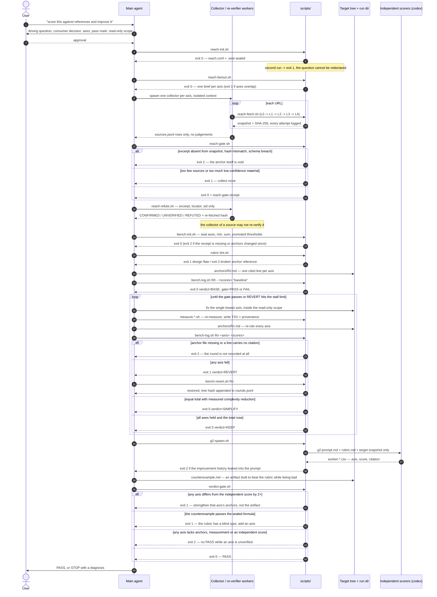

# How a run works

One complete run, traced end to end: who acts, what each step produces, and where it can be refused. For the exit-code reference of every script see [gates.md](gates.md); for why the enforcement is shaped this way see [design-decisions.md](design-decisions.md).

## 1. Who acts

Four actors, and the boundaries between them are the point. Most failures of an agent-driven pipeline come from one actor quietly doing another's job.

| Actor | Responsibility | Explicitly not allowed to |
|---|---|---|
| **User** | Names the target and the decision the work serves. Approves the axes, the pass mark and the read-only scope before the loop starts. Accepts or rejects the final verdict. | Lower the pass mark after a failed round. |
| **Main agent** | Drives R0→G3. Runs the scripts, writes the contract files, edits the target, and executes the actual revert when a round fails. | Decide whether a round passed. `min`, `sum`, the gate result and the Pareto comparison are computed by `bench-log.sh`, never typed in. |
| **Collector / re-verifier workers** | One collector per axis, in an isolated context: fetch, snapshot, append rows to `sources.jsonl`. Re-verifiers re-open the original URL and rule on each anchor. | Judge confidence or assign axes. Collectors collect; tagging happens once, centrally, at R3. A re-verifier may not be the worker that collected the source. |
| **Scripts** | Seal, hash, compare excerpts against snapshots, compute verdicts, count stalls, refuse. | Edit the target or perform the revert. They judge; the agent acts. |

A fifth participant appears only at G2: independent scorers spawned as separate `codex` processes, given the rubric and the target snapshot and nothing else — no improvement history, no self-assigned scores, no round anchors.

## 2. Axis 1 — Reach

### R0 · Seal the question

`reach-init.sh <run-dir> <question-file> <min-sources> <poc-max-pct>` writes `question.md`, `reach.conf` and `reach.conf.seal`. Sealed fields include the SHA-256 of the question, the minimum number of sources and primary sources, the ceiling on low-confidence anchors, the ceiling on manually pasted sources, and the allowed axis count.

The question must be a single sentence ending in a question mark and must name the decision it serves. Re-running against an existing run is refused (exit 1). An unfixed question is not a small problem: if the question can move afterwards, the collected material gets reinterpreted to fit whatever was found.

### R1 · Fan out into axes

`reach-fanout.sh <run-dir> <axes.tsv>` splits the question into 3–7 sub-questions and writes one worker brief per axis under `briefs/`. It refuses duplicate axis IDs, a missing target-source count, and axis statements whose 3-gram overlap is too high — near-duplicate axes produce near-duplicate evidence and inflate the apparent breadth of the research.

Each brief fixes three things and nothing else: the axis ID, the return path, and the row schema. Workers return rows, not conclusions.

### R2 · Climb the fixed ladder

`reach-fetch.sh <run-dir> <url> <axis-id> [--channel <name>]` walks the rungs in the order declared in `contracts/channels.yml`:

| Rung | Means | Used when |
|---|---|---|
| L0 | Official public API (`gh api`, arXiv, HN, Bluesky, RSS) | The host matches a channel declaration |
| L1 | The `insane-search` skill (WAF grid, TLS impersonation, real Chrome) | The verdict indicates a challenge |
| L2 | `WebFetch` / `WebSearch` | Ordinary public pages |
| L3 | `r.jina.ai` reader proxy | L2 returned a shell or partial body |
| L4 | Manual — a human pastes the text and names the source | Auth or paywall |

The order *is* the policy. Replacing a backend means reordering a list in `channels.yml`, not editing a script; `install-gate.sh` fails the tree if platform-specific strings appear in `scripts/`.

Five rules govern the climb. `rate_limited` (429) is not terminal, so the ladder continues. `auth_required` and `not_found` are terminal: the run drops to L4 rather than logging in. A failure cannot be declared while `untried_ladder` is non-empty — every rung must have been tried or explicitly skipped as unavailable. Success writes the body to `sources/<sid>.md` with its SHA-256, because a source without a reproducible snapshot is not a source. And credentials are scrubbed from the text once, immediately before it is written.

Every attempt, including the failures, lands in `fetch-log.jsonl`. Access failure is recorded as failure; it never becomes an anchor.

### R3 · The single gate into Axis 2

`reach-gate.sh <run-dir>` is the only door. It checks, in order:

1. Enough distinct sources, enough of them primary.
2. Every snapshot exists and its SHA-256 still matches.
3. **Every `excerpt` is a literal substring of its snapshot.** This is the mechanical form of "a summary cannot be used for scoring".
4. Anchors sourced from a failed access are rejected.
5. Low-confidence and manually pasted material stays under the sealed ceilings; a manual source cannot exceed `med` confidence.
6. Marketing sources yield vendor claims only, and never back an automatically verified axis.
7. A `measured:true` anchor must match an actual cell in a `metrics/*.tsv` that carries a valid provenance sidecar.

Passing writes `reach-gate.receipt`, which records the hashes of `reach.conf`, `sources.jsonl` and `anchors.jsonl` at that instant. Axis 2 refuses to start without it.

### R4 · Attack the anchors from elsewhere

`reach-refute.sh <run-dir> [--workers N]` spawns re-verifiers that receive only the excerpt, the locator and the source ID — never the collection context or the axis assignment. Each anchor gets `CONFIRMED`, `UNVERIFIED` or `REFUTED`; the last two are not evidence. A re-verifier must prove it actually re-opened the original URL by returning a fresh hash that differs from the stored snapshot's, and it may not be the worker that collected the source.

`REFUTED` rows are demoted with `active:false`, never deleted. The audit trail is part of the product: this repository's own [genealogy](genealogy.md) lost 8 of 30 claims this way.

### R5 · Promote measurements into preconditions

A `CONFIRMED` anchor that is a metric, is marked `measured:true`, and carries a reproducible `measure` command does not become a 0–4 axis. It becomes a sealed pass/fail threshold inside `gate.conf`. Anything a script can decide should not be scored by a human — and once sealed, the threshold cannot move for the rest of the run.

## 3. Axis 2 — Bench

`bench-init.sh` seals the axes, `min`, `sum`, the read-only scope and the promoted thresholds, then refuses ever to do it again. `rubric-lint.sh` refuses a rubric whose axes disagree with `gate.conf`, whose 0/3/4 levels do not cite existing confirmed anchors, whose 0-point and 4-point anchors come from the same source (the mechanical signature of "define copying the reference as full marks"), or whose automatically verified axes lack a `measure:` command with real output. `bench-log.sh` records one round at a time and computes every verdict itself. `bench-revert.sh` performs the restoration and leaves a hash of the restored tree, which the next `bench-log.sh` call demands to see.

Then three gates: `measure-*.sh` judges the sealed thresholds by exit code, `g2-spawn.sh` runs independent scorers with the improvement history physically excluded from the prompt, and `verdict-gate.sh` is the only place in the system that can print `PASS`.

## 4. The trace

## 5. Scale branches

The pipeline is not all-or-nothing, but what may be skipped is fixed in advance rather than chosen when it becomes inconvenient.

| Scale | Condition | Runs | May skip | Never skips |
|---|---|---|---|---|
| **Single** | One artifact, 3–4 axes | R0–R3, S0–S4, G1 | G2 independent scoring, G3 counterexample. R4 may be self-re-verification when there are 5 or fewer anchors | `reach-gate.sh` and the citation requirement. Without those it is an LLM admiring its own work |
| **Full** | 5+ axes, or a rubric that will be reused | R0–R5, S0–S4, G1–G3 | nothing | everything |
| **Rubric reuse** | The rubric already exists | Collect the new target's sources through R0–R4, then enter at S3 | S2 axis derivation | Re-confirming that the existing anchors are still `CONFIRMED` |

One override outranks scale: if more than half the axes are qualitative — that is, without a `measure:` command — G2 is never skipped, and `verdict-gate.sh` decides that ratio itself from the rubric rather than trusting the operator's judgement.

## 6. Stopping

A run ends in one of three ways, and only the first is a pass.

- **PASS** — `verdict-gate.sh` printed it. Nothing else in the system can.
- **STOP, diagnosis** — three consecutive REVERTs. At that point the suspect is the rubric, not the artifact: an axis may be measuring a precondition, or its anchors may be too vague to move. The loop closes and the rubric is re-examined.
- **STOP, scope** — the work needed sits outside the sealed read-only boundary. The boundary does not move mid-run; the run closes and a new one is scoped.

Improving past a pass is prohibited. Once the gate passes, the loop stops.
